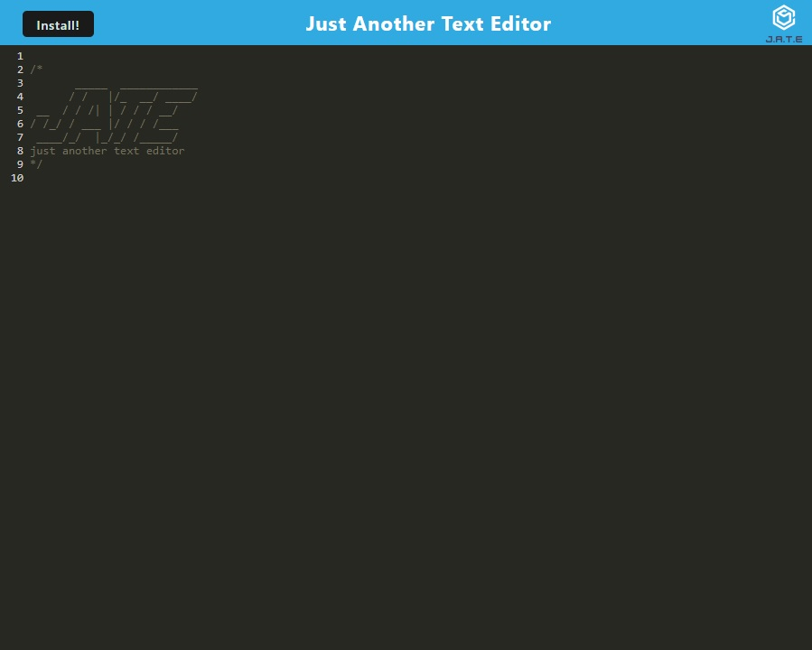

# Simple Text Editor
This is a simple text editor that illustrates how to structure a PWA (Progressive Web Application) that can be installed on any device with a modern browser.

[](https://opensource.org/licenses/MIT)

## Installation
To install this project, clone the repository to your local machine and run the following commands:
```
## Usage
To start the server, run the following command:
``` 
npm start
```
This will start the server on http://localhost:3000.
```

## Application Screenshot 

Simple Text Editor 




## Website Link
[Simple Text Editor](https://jate-text-editor-application.herokuapp.com/)

## App Installation
- Click the Install Button
- Click Install on the prompt, this will install the app in your device.
